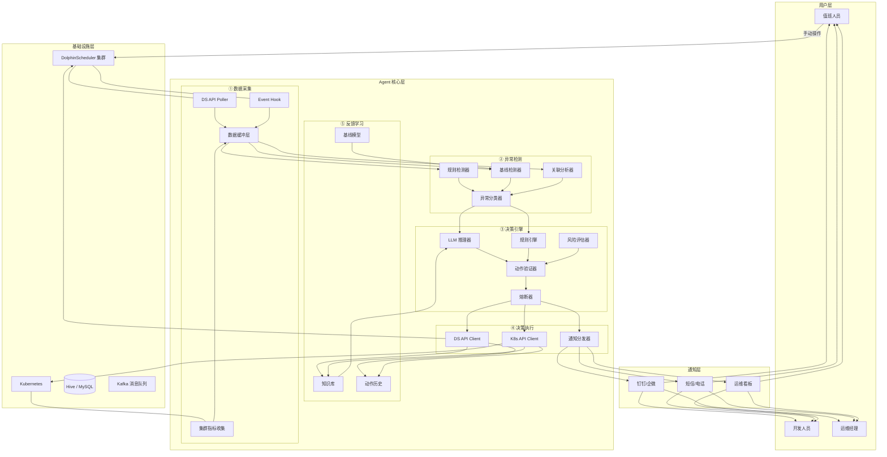
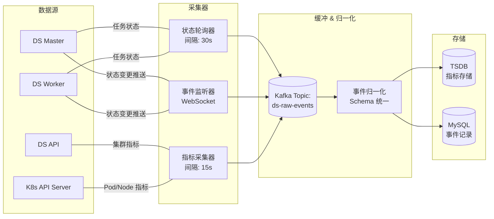
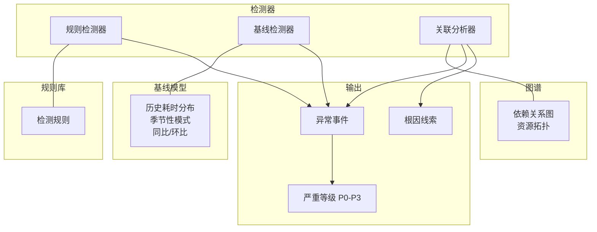
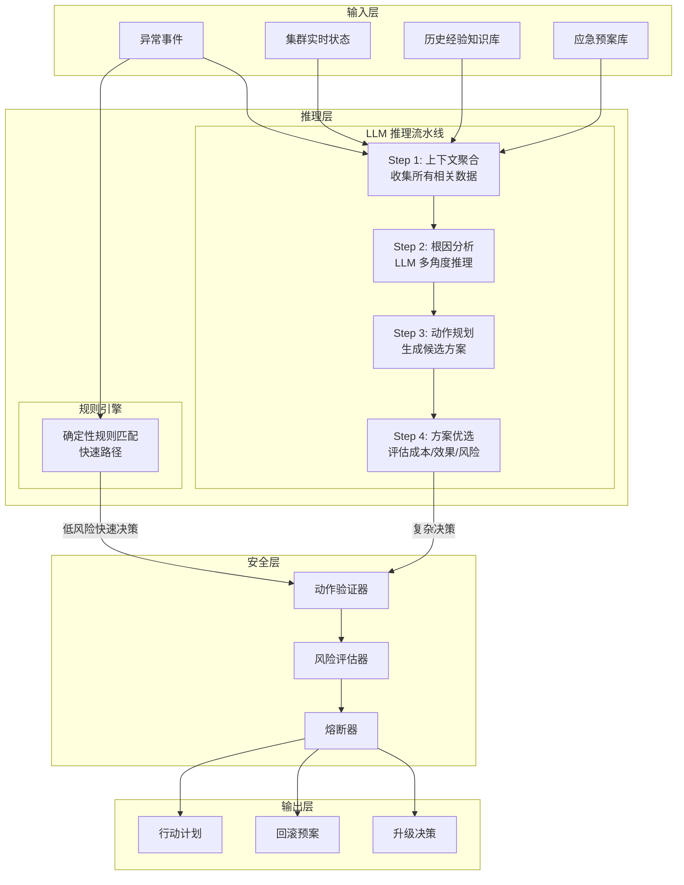
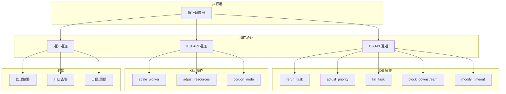
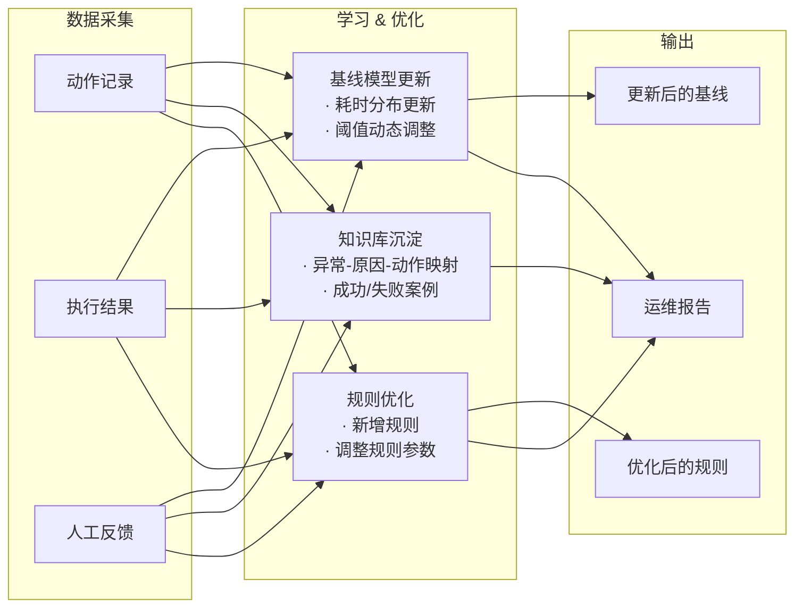
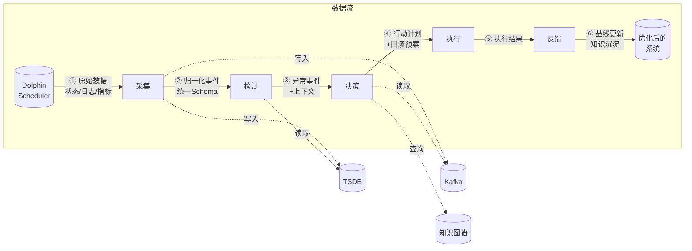

# 智能运维 Agent 系统架构

## 一、整体架构分层



## 二、组件详情

### ① 数据采集层



| 组件 | 职责 | 采集内容 |
|------|------|---------|
| 状态轮询器 | 定时调用 DS REST API | 工作流实例状态、任务实例状态、流程定义 |
| 事件监听器 | 接收 DS 主动推送 | 任务创建/运行/失败/完成事件 |
| 指标采集器 | 采集集群资源指标 | Worker CPU/内存、队列深度、连接池状态 |
| 数据缓冲层 | 削峰填谷、解耦 | Kafka 异步缓冲，统一事件 Schema |

### ② 异常检测层



| 检测器 | 检测方式 | 典型规则 |
|--------|---------|---------|
| **规则检测器** | 确定性匹配 | 超时 > 阈值、重试 > N 次、错误码匹配、资源使用率 > 90% |
| **基线检测器** | 统计异常检测 | 耗时偏离历史均值 3σ、同比/环比偏差 > 50%、季节性模式违例 |
| **关联分析器** | 图谱推理 | 上游任务未完成、资源竞争任务列表、共享资源瓶颈点 |

### ③ 决策引擎 (核心大脑)



| 模块 | 说明 |
|------|------|
| **LLM 推理器** | 核心智能，负责根因分析、动作规划、方案优选。需要强推理能力的模型 |
| **规则引擎** | 快速路径，对已知确定性场景直接出决策，不经过 LLM（降低延迟和成本） |
| **动作验证器** | 安全检查，验证操作是否在白名单、频次是否超限、目标是否在灰度范围 |
| **风险评估器** | 评估动作影响范围、回滚成本、历史成功率 |
| **熔断器** | 自我保护，连续失败 N 次后自动熔断，降级为只告警 |

### ④ 执行层



| 操作 | 触发条件 | 风险等级 | 幂等性 |
|------|---------|---------|-------|
| rerun_task | 任务失败且可重试 | 低 | 是 |
| adjust_priority | 资源竞争导致排队 | 中 | 是 |
| kill_task | 任务卡死/死循环 | 高 | 是 |
| block_downstream | 上游数据异常，防止污染下游 | 中 | 是 |
| scale_worker | Worker 满载/队列积压 | 低 | 是 |
| adjust_resources | 单个任务 OOM/超时 | 低 | 是 |

### ⑤ 反馈学习层



## 三、部署架构

```mermaid
graph TB
    subgraph "Kubernetes 集群"
        subgraph "ds-namespace"
            DS_M1[DS Master-1]
            DS_M2[DS Master-2]
            DS_W1[DS Worker-1]
            DS_W2[DS Worker-2]
            DS_WN[DS Worker-N]
        end

        subgraph "ops-agent-namespace"
            SUBGRAPH "Agent 服务"
                API[Operator API<br/>2 pods]
                SVC[Agent Core<br/>2 pods]
                CACHE[(Redis<br/>缓存/队列)]
            end

            subgraph "MCP Servers"
                M1[ds-monitor<br/>2 pods]
                M2[ds-operator<br/>2 pods]
                M3[knowledge<br/>1 pod]
            end

            subgraph "数据管道"
                K1[Kafka<br/>3 brokers]
                FLINK[Flink<br/>实时处理]
            end

            subgraph "存储"
                TSDB[(Prometheus<br/> + Thanos)]
                MYSQL[(MySQL<br/>主从)]
            end
        end
    end

    subgraph "外部依赖"
        LDAP[LDAP/SSO]
        MAIL[邮件网关]
        SMS[短信网关]
    end

    DS_M1 & DS_M2 ---|API| M1 & M2
    M1 & M2 & M3 ---|stdio IPC| SVC
    SVC --- API
    API ---|外部访问| LDAP
    SVC ---|通知| MAIL & SMS
```

## 四、数据流全景



## 五、技术栈

| 层 | 组件 | 技术选型 | 说明 |
|----|------|---------|------|
| 数据采集 | Poller | Python + asyncio + aiohttp | 异步非阻塞轮询 |
| 数据采集 | Event Hook | DS Webhook / Python | 接收 DS 推送 |
| 数据缓冲 | 消息队列 | Kafka | 削峰填谷，异步解耦 |
| 异常检测 | 规则引擎 | Drools / Python Rule Engine | 确定性规则匹配 |
| 异常检测 | 基线模型 | Prophet / statsmodels | 时序异常检测 |
| 决策引擎 | LLM 推理 | GPT-4 / DeepSeek / Qwen | 根因分析 + 动作规划 |
| 决策引擎 | 知识库 | Chroma / Milvus 向量库 | 相似故障检索 |
| 执行层 | DS API | Python requests + DS REST API | 操作 DS |
| 执行层 | K8s API | kubernetes-client Python | 操作 K8s |
| 存储 | 时序数据 | Prometheus + Thanos | 指标存储 |
| 存储 | 事件数据 | MySQL / PostgreSQL | 事件记录 |
| 存储 | 缓存 | Redis | 实时状态、队列 |
| 通知 | 消息推送 | 钉钉/企微 Robot API | 告警通知 |