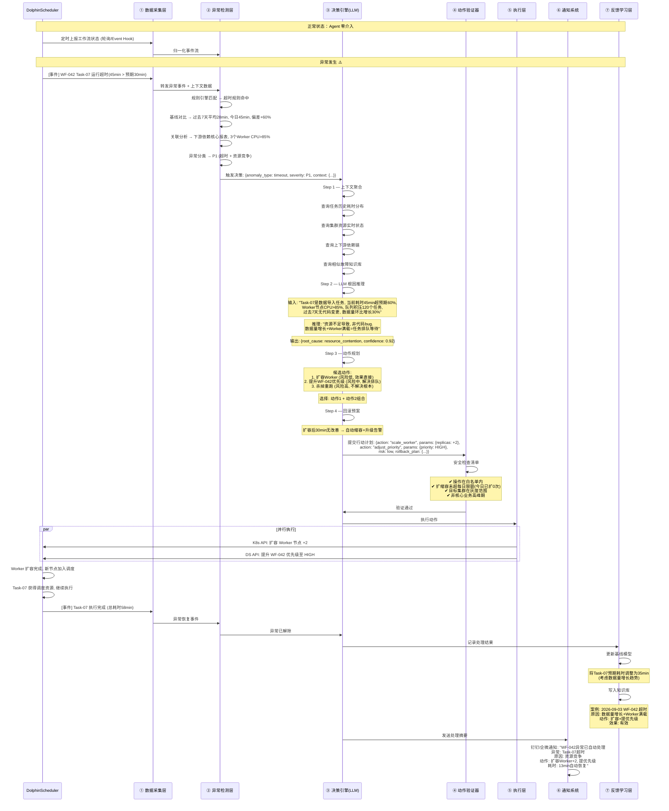
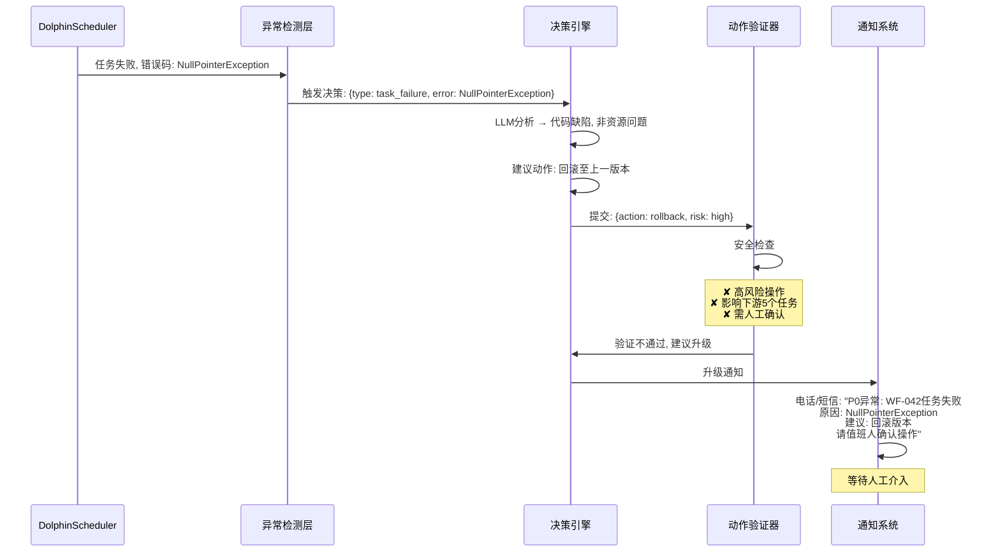
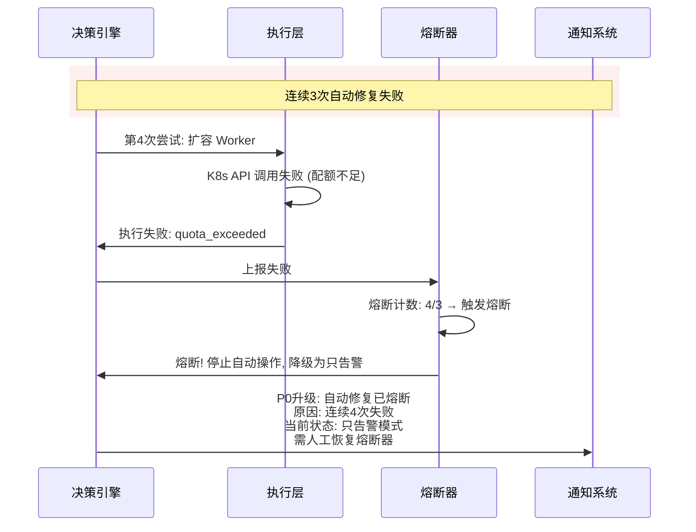

# 智能运维 Agent 时序图

## 主流程：异常自动处理

```mermaid
sequenceDiagram
    participant DS as DolphinScheduler
    participant Collector as ① 数据采集层
    participant Detector as ② 异常检测层
    participant Engine as ③ 决策引擎(LLM)
    participant Validator as ④ 动作验证器
    participant Executor as ⑤ 执行层
    participant Notifier as ⑥ 通知系统
    participant Feedback as ⑦ 反馈学习层

    Note over DS,Feedback: 正常状态：Agent 零介入

    DS->>Collector: 定时上报工作流状态 (轮询/Event Hook)
    Collector->>Detector: 归一化事件流

    Note over DS,Feedback: 异常发生 ⚠️

    DS->>Collector: [事件] WF-042 Task-07 运行超时(45min > 预期30min)
    Collector->>Detector: 转发异常事件 + 上下文数据

    Detector->>Detector: 规则引擎匹配 → 超时规则命中
    Detector->>Detector: 基线对比 → 过去7天平均28min, 今日45min, 偏差+60%
    Detector->>Detector: 关联分析 → 下游依赖核心报表, 3个Worker CPU>85%
    Detector->>Detector: 异常分类 → P1 (超时 + 资源竞争)
    Detector->>Engine: 触发决策: {anomaly_type: timeout, severity: P1, context: {...}}

    Engine->>Engine: Step 1 — 上下文聚合
    Engine->>Engine: 查询任务历史耗时分布
    Engine->>Engine: 查询集群资源实时状态
    Engine->>Engine: 查询上下游依赖链
    Engine->>Engine: 查询相似故障知识库

    Engine->>Engine: Step 2 — LLM 根因推理
    Note over Engine: 输入: "Task-07是数据导入任务, 当前耗时45min超预期60%,<br/>Worker节点CPU>85%, 队列积压120个任务,<br/>过去7天无代码变更, 数据量环比增长30%"
    Note over Engine: 推理: "资源不足导致, 非代码bug.<br/>数据量增长+Worker满载=任务排队等待"
    Note over Engine: 输出: {root_cause: resource_contention, confidence: 0.92}

    Engine->>Engine: Step 3 — 动作规划
    Note over Engine: 候选动作: <br/>1. 扩容Worker (风险低, 效果直接)<br/>2. 提升WF-042优先级 (风险中, 解决排队)<br/>3. 杀掉重跑 (风险高, 不解决根本)
    Note over Engine: 选择: 动作1 + 动作2组合

    Engine->>Engine: Step 4 — 回滚预案
    Note over Engine: 扩容后30min无改善 → 自动缩容+升级告警

    Engine->>Validator: 提交行动计划: {action: "scale_worker", params: {replicas: +2}, <br/>                         action: "adjust_priority", params: {priority: HIGH}, <br/>                         risk: low, rollback_plan: {...}}

    Validator->>Validator: 安全检查清单
    Note over Validator: ✔ 操作在白名单内<br/>✔ 扩缩容未超每日限额(今日已扩0次)<br/>✔ 目标集群在灰度范围<br/>✔ 非核心业务高峰期

    Validator->>Engine: 验证通过

    Engine->>Executor: 执行动作

    par 并行执行
        Executor->>DS: K8s API: 扩容 Worker 节点 +2
        Executor->>DS: DS API: 提升 WF-042 优先级至 HIGH
    end

    DS->>DS: Worker 扩容完成, 新节点加入调度
    DS->>DS: Task-07 获得调度资源, 继续执行
    DS->>Collector: [事件] Task-07 执行完成 (总耗时58min)

    Collector->>Detector: 异常恢复事件
    Detector->>Engine: 异常已解除

    Engine->>Feedback: 记录处理结果

    Feedback->>Feedback: 更新基线模型
    Note over Feedback: 将Task-07预期耗时调整为35min<br/>(考虑数据量增长趋势)

    Feedback->>Feedback: 写入知识库
    Note over Feedback: 案例: 2026-09-03 WF-042 超时<br/>原因: 数据量增长+Worker满载<br/>动作: 扩容+提优先级<br/>效果: 有效

    Engine->>Notifier: 发送处理摘要
    Notifier->>Notifier: 钉钉/企微通知: "WF-042异常已自动处理<br/>异常: Task-07超时<br/>原因: 资源竞争<br/>动作: 扩容Worker+2, 提优先级<br/>耗时: 13min自动恢复"
```

## 边缘场景：验证失败 → 升级到人工

```mermaid
sequenceDiagram
    participant DS as DolphinScheduler
    participant Detector as 异常检测层
    participant Engine as 决策引擎
    participant Validator as 动作验证器
    participant Notifier as 通知系统

    DS->>Detector: 任务失败, 错误码: NullPointerException
    Detector->>Engine: 触发决策: {type: task_failure, error: NullPointerException}

    Engine->>Engine: LLM分析 → 代码缺陷, 非资源问题
    Engine->>Engine: 建议动作: 回滚至上一版本

    Engine->>Validator: 提交: {action: rollback, risk: high}

    Validator->>Validator: 安全检查
    Note over Validator: ✘ 高风险操作<br/>✘ 影响下游5个任务<br/>✘ 需人工确认

    Validator->>Engine: 验证不通过, 建议升级

    Engine->>Notifier: 升级通知
    Notifier->>Notifier: 电话/短信: "P0异常: WF-042任务失败<br/>原因: NullPointerException<br/>建议: 回滚版本<br/>请值班人确认操作"
    Note over Notifier: 等待人工介入
```

## 边缘场景：执行失败 → 熔断 & 降级

```mermaid
sequenceDiagram
    participant Engine as 决策引擎
    participant Executor as 执行层
    participant CircuitBreaker as 熔断器
    participant Notifier as 通知系统

    rect rgb(255, 240, 240)
        Note over Engine,Notifier: 连续3次自动修复失败
    end

    Engine->>Executor: 第4次尝试: 扩容 Worker
    Executor->>Executor: K8s API 调用失败 (配额不足)
    Executor->>Engine: 执行失败: quota_exceeded
    Engine->>CircuitBreaker: 上报失败

    CircuitBreaker->>CircuitBreaker: 熔断计数: 4/3 → 触发熔断
    CircuitBreaker->>Engine: 熔断! 停止自动操作, 降级为只告警

    Engine->>Notifier: P0升级: 自动修复已熔断<br/>原因: 连续4次失败<br/>当前状态: 只告警模式<br/>需人工恢复熔断器
```